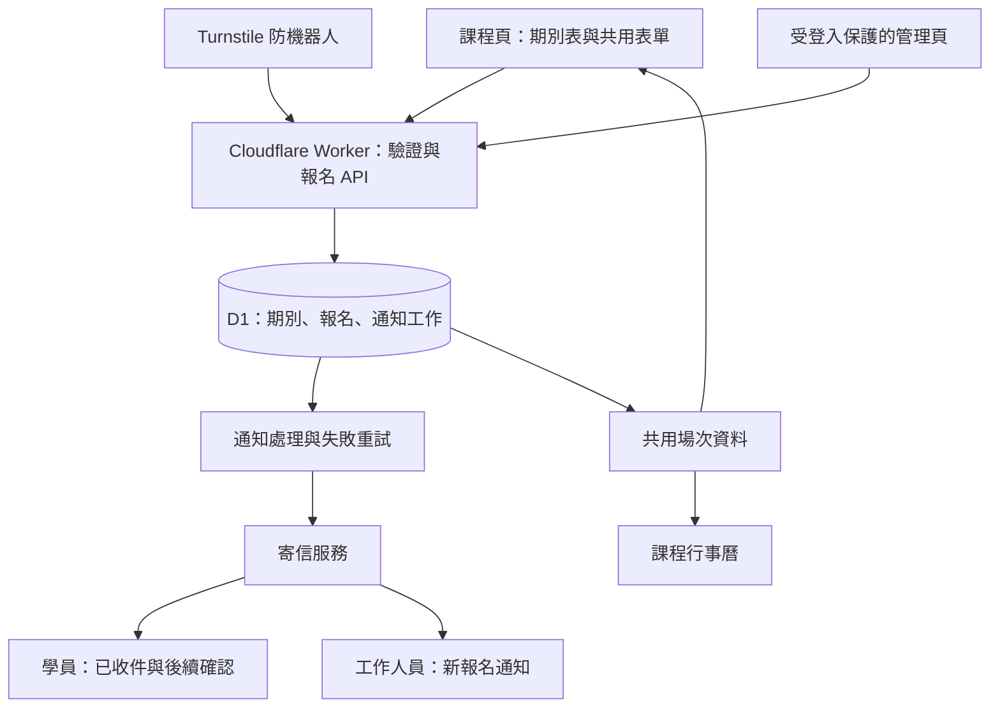

# 關係花園：課程期別、報名與通知系統規劃

日期：2026-09-23。狀態：已確認主收件人及採用 Zell 既有 Resend 帳號的免費方案；其他流程仍為討論稿。寄信網域 notify.rsg.com.tw 的 Cloudflare 三筆 DNS 已寫入且公開解析正確；Resend 已確認 Verified，API Key 與試寄尚未完成，詳見 resend-setup-20260923.md。

## 建議決策

建置新站自己的共用報名表，以 Cloudflare Workers 處理送出、D1 保存資料，再由寄信服務通知學員與工作人員。舊 WordPress 停用後，期別、報名、通知與工作人員操作都必須能獨立運作。

第一版建議採「先報名 → 收到申請編號 → 匯款 → 人工核對 → 正式確認」。送出表單僅代表收到申請，不代表付款成功或保證名額。此流程仍待業主確認。

課程文案保持現在已確認的樣式；只把期別表與報名區換成全站共用元件。工作人員從簡單後台管理期別和名單，不需要進 Git 改 HTML。

## 規劃時的基線（實作前）

2026-09-23 後續更新：已完成 `/archives/7586` 的本地報名試作、Worker／D1 與共用 UI，15 項測試通過；正式設定仍 disabled，未部署、未建立 API Key、未實際試寄。以下保留原始盤點，最新實作狀態見 `registration-pilot-20260923.md`。

- 主站 `rsg-site/wrangler.jsonc` 目前只有靜態資產設定，沒有報名 API、D1 或寄信綁定。`rsg-edge` 是另一個既有用途的 Worker，不將報名功能混進其 WordPress 代理／學習指南流程。
- 14 個團體課程暫時以 `registrationUrl` 連回原站 Contact Form 7；一對一排列使用線上客服預約。使用者已明確否決舊站報名依賴，本方案取代該暫行方式。
- 目前課程日期表寫在文章 HTML；行事曆則讀 `content/events`，是兩套資料。
- 原站表單抽查 6553、2061、2059、7586：姓名、性別、手機、LINE ID、Email、期別、付款方式、匯款後五碼、推薦人。部分必填設定不一致，例如推薦人標籤未寫必填，但輸入欄位設為必填。
- 原站 6553 還有 2024 年場次，2059 有 2025 年場次；不能原樣匯入成可報名場次。7586 同時存在已過期與未來日期，需按台北時間判斷。
- 2026-09-23 公開 DNS 查詢顯示 `rsg.com.tw` 的 MX 指向 Cloudflare Email Routing。這只能確認入口，不能得知轉寄目的信箱、是否有人收件，或對外寄信權限。使用者已確認主收件地址為 `Garden@rsg.com.tw`；實際收件與回覆能力仍須在寄信測試時驗證。

## 1. 統一期別表與資料

桌面表格統一為：**期別｜日期與時間｜地點｜報名狀態／操作**。保留目前網站的淡色底、細灰線、深藍文字和水藍按鈕。手機改成每期一列的直式資訊區，避免必須左右滑動才能找到報名按鈕。

- 日期顯示完整年份與星期，多日或非連續日期逐日呈現；時區一律 `Asia/Taipei`。
- 地點包含名稱、必要時展開地址／地圖；線上課程只公開「線上」，會議連結不放公開 API。
- 可見狀態：開放報名、額滿、候補（啟用才出現）、截止、籌備中。已結束場次不在公開表格或行事曆顯示，後台保留歷史紀錄。
- 沒有已確認的新期別時，顯示「新一期籌備中」與聯絡方式，不讓舊日期仍可送出報名。
- 按該列「我要報名」，捲動到本頁共用表單，預選課程和期別。從表單再換期別時，同步更新日期、地點與費用摘要。
- 場次有穩定 ID；期別用文字欄位保存（如 `01`、`第二期`），不是識別碼，避免不同課程撞號或前導零消失。
- 課程頁表格、行事曆、表單及通知信都讀同一份 D1 場次資料。舊活動紀錄需先對應課程／場次、去重；非課程型活動仍保留在行事曆，不一概刪除。

## 2. 共用報名表

本頁內嵌表單，沿用置中標題和水藍區塊，欄位標籤靠左，手機單欄。所有課程使用同一元件；差異以設定傳入，不逐頁另寫 CSS 或驗證 JS。

| 欄位 | 第一版建議 |
|---|---|
| 課程、期別、日期、地點、費用 | 由場次帶入，送出後由伺服器再次查核 |
| 姓名、手機、Email | 必填；手機使用文字格式，保留前導零與國碼 |
| LINE ID | 選填，降低沒有 LINE ID 的學員填寫障礙；若窗口仰賴 LINE，再確認是否改必填 |
| 推薦人、備註 | 選填；不要求填寫療癒議題、健康細節或其他不必要的私人資料 |
| 性別 | 建議第一版不收；若確有課程作業需求，再由業主確認 |
| 付款 | 第一版匯款／轉帳；未付款者不必先填後五碼 |
| 匯款回報 | 付款後用受保護連結補填匯款日期、金額、後五碼；標記「已回報待核對」 |
| 告知與同意 | 顯示用途與報名須知，記錄版本及時間；行銷訂閱獨立選填，不預勾 |

送出後保留清楚的成功頁：申請編號、課程／期別摘要、下一步、聯絡方式。錯誤時保留已填內容並指出需修正的欄位。未來如需發票、飲食、複訓或課程先修條件，以共用欄位設定擴充。

一對一排列採同一套基礎元件的「預約申請」模式：期望日期／時段、姓名、聯絡方式，由工作人員協調，不假造團體課程期別或自動確認預約。

銀行資料需重新核對後再上線；不能因舊表單有帳號就當成最新有效資訊。第一版不收款、不刷卡、不要求上傳匯款截圖。若改做線上金流，另設付款訂單與經驗證的金流回呼，不以瀏覽器付款成功頁直接認定已收款。

## 3. Cloudflare 架構

- 保留 Astro 靜態長文、圖片和既有網址；主站 Worker 新增 API、D1 綁定、排程及必要動態回應。路由限定 API／管理頁／需要即時場次的頁面，其餘靜態資產照原方式供應。實作前核對現有建置與路由，避免 `_redirects`、SEO 及舊網址受影響。
- 課程場次區塊由共用服務產生；首屏 HTML 需含可閱讀的日期／地點與相符結構化資料，不能只留空白等 JS。可在 Worker 中以共用伺服器渲染補入靜態頁的場次區；瀏覽器的期別切換再讀同一 API。公開場次可短暫快取，異動清除快取；送出時永遠查 D1 最新狀態。
- 建議資料表：`courses`（對應現有文章）、`sessions`（期別／狀態／費用）、`session_dates`（各上課日及時段）、`registrations`（申請與付款狀態）、`notification_jobs`（收件對象、重試、寄信紀錄）、`audit_log`（後台異動紀錄）。地點可先放場次欄位，不必一開始建立複雜 CRM。
- 報名時保存課程名稱、日期、地點及費用的當時版本。日後改期或改價可追蹤，不能悄悄改寫已寄出的承諾；已有人報名的場次異動要提示工作人員通知學員。
- 申請與通知工作一起可靠寫入 D1，再回覆「已收到申請」。通知失敗不丟報名、不要求學員重填。小量第一版可用 D1 通知工作表加 Worker 排程處理，暫不額外引入 Queues。
- 每次提交有冪等識別碼，重按／網路重試不重複建單；寄信工作亦有唯一識別和處理鎖。伺服器逾時且不知道郵件是否已送出時先查紀錄，不盲目換服務重寄。接受寄信與實際投遞分開記錄；支援供應商的退信事件。
- 第一期採人工確認名額，待處理申請不算已確認名額；管理頁清楚分開待處理／已確認。若採自動名額保留，須新增原子名額檢查與保留到期規則，不能只看前端「剩餘名額」。
- Turnstile 必須由伺服器驗證，另做送出頻率限制、欄位長度與格式檢查；課程／期別／費用由伺服器查，不能相信用戶傳來的值。拒絕已截止、取消、不屬於該課程的期別。
- 報名、匯款回報、後台及個人查詢回應不快取，不進 sitemap／Pagefind。密鑰使用 Workers Secrets。匯款回報用隨機、限時且可撤銷的憑證，只能操作該筆申請；不能拿可猜的申請流水號查他人資料。
- 管理頁及管理 API 都須驗證身分與權限，可用 Cloudflare Access；不能只藏網址，也不能從未保護的 workers.dev 別名繞過。CSV 匯出需避免試算表公式注入。正式與測試 D1／寄信收件者分開，測試不寄給真實學員。

## 4. 寄信與收信安排

「寄件名稱／地址」「提供寄信能力的服務」「真的有人操作的收件箱」是三件事。網站架在 Workers，不代表已經有可供工作人員閱讀和回覆的信箱。

| 用途 | 建議設定，尚未建立 |
|---|---|
| 對學員寄信 | 顯示名稱「關係花園｜課程報名」，地址 `registration@notify.rsg.com.tw`；使用專用寄信子網域，便於獨立驗證及更換服務 |
| 學員按回覆 | Reply-To 使用已確認的 `Garden@rsg.com.tw` |
| 新報名主通知 | 使用者已確認：`Garden@rsg.com.tw` |
| 其他內部通知 | Roger／備援窗口只在確認需要及地址後加入，分開寄送，不把所有人暴露在學員信件 CC |
| 工作人員回覆 | 由既有信箱供應商寄送；若只有 Cloudflare 轉寄，需確認接收端可用公司地址回覆，Email Routing 本身不是完整信箱介面 |

學員收到「已收到報名申請」；課務收到申請編號、課程期別及後台連結，信內只含處理所需的基本資料。工作人員核對款項／名額後再寄「報名確認」。每種通知各自記錄成功或失敗、支援重送；資料庫名單才是完整紀錄，不能靠信箱當唯一名單。

### 寄信供應商取捨

依 2026-09-23 查閱的官方資料：

| 方案 | 成本及條件 | 建議 |
|---|---|---|
| Cloudflare Email Service | 對一般學員寄信需 Workers Paid；目前包含每月 3,000 封，超額 US$0.35／千封。Workers Paid 基本 US$5／月起。寄信仍為 Beta，新帳戶另有逐步調整的每日額度 | 本次不採用；保留作日後比較，無需為此開通 Email Service |
| Resend | Free 每月 3,000 封、每日 100 封；Pro US$20／月含 50,000 封。Workers／資料庫費用另計 | 已選定：沿用 Zell 帳號，新增 RSG 專用網域與受限 API Key。與同一 Team 其他專案共用額度 |

例如每筆申請寄學員與課務各一封，500 筆約 1,000 封；再寄正式確認約增至 1,500 封，尚未包含副本、補件及重寄。Cloudflare 的已驗證目的信箱另有免費規則，但預算先按一般寄送估算。實際額度按帳戶共享，需連同其他網站用量確認。

已選定 Resend Free，無需為寄信而升級 Cloudflare Workers Paid；Workers／D1 仍按實際使用量與帳戶方案決定，尚未開通或升級。免費方案的 100 封／日、3,000 封／月需與同一 Team 的伯大尼等專案合併估算，每個 To／CC／BCC 收件人各計一封。每日額度依 UTC 重設。不能因 RSG 自身少於 100 封，就認定總額度一定足夠。寄信程式留共用介面，讓日後換供應商不用改 15 個課程頁。

寄信前設定並驗證 SPF／DKIM／DMARC、退信處理及 Reply-To。保留目前主網域收信 MX，不為新增寄信服務直接覆蓋既有收信路由。先確認 `Garden@` 的實際轉寄目的地、收件與回覆能力，再決定是否新增別名／郵件群組。主收件與 Reply-To 已定為 Garden@rsg.com.tw；寄件子網域及寄件地址仍待實際設定和驗證。

## 5. 工作人員如何維護

第一版管理頁只做三件事：

1. 期別：新增／複製期別、設定日期地點費用與截止日、開放／關閉／額滿；發布後三個前台位置同步。
2. 名單：按課程／期別篩選，查看報名，分別標記「待處理／已確認／取消」及「未付款／已回報／已核對」，匯出 CSV。
3. 通知：查看寄信結果、退信或待重試項目，重新寄送；記錄誰做了哪個變更。

不必在第一版加入會員登入、CRM、電子報、優惠券、金流、檔案上傳。學員不需註冊帳號即可申請。管理與收件帳戶應由業主或明確約定的管理方持有，文件交接給 Roger。

報名資料、通知日誌、備份各自訂保存與刪除規則；正式上線前與業主確認，並完成備份與還原演練。公開頁不顯示報名名單，日誌不記完整表單個資。

## 6. 實作順序與驗收

1. 確認收件人、付款順序、必要欄位、可接受的寄信方案；由窗口確認可開放報名的最新場次與銀行資料。
2. 先將期別資料整理及對應，建立共用表格與本地表單原型；挑一個仍有未來場次的團體課程驗證。一對一排列另驗預約模式。
3. 本地完成 D1、提交、後台及通知重試，再以隔離的測試環境和指定測試收件箱測試。
4. 驗收：重複送出只建一筆、截止與錯誤期別遭拒、修改日期三處同步、寄信故障時資料仍在、付款回報不自動變已付款、後台及其 API 無法未登入存取、手機／鍵盤操作可完成。
5. 寄至指定 Gmail／Outlook 等測試地址，檢查收件、垃圾信、回覆地址、退信紀錄。所有寄信測試另依明確指定的收件人進行，不對真實學員測試。
6. 通過後套用全部課程與舊活動入口，清除 WordPress 表單網址／錨點依賴；停用舊站前遷移仍待處理的舊報名並核對筆數，完成切換／回復方案。
7. 正式版所有報名流程、款項回報與通知不依賴舊站，完成後再安排停用 WordPress。版面程式可回復，但已收到的報名資料不能因程式回復而刪除。

## 7. 待確認的營運資訊

- 主收件與 Reply-To 已定為 `Garden@rsg.com.tw`；仍待確認備援收件人、Roger 通知／後台權限，以及實際收件與回覆測試。
- 先報名後匯款、先匯款後報名，或需第一版串金流；名額何時確認、付款期限與取消方式。
- LINE ID 是否必填、性別是否真的需要、是否有先修或複訓差異。
- 最新可報名場次、費用、帳戶資料；只沿用舊資料不可當作重新開放報名的依據。
- Resend 已選免費方案；登入後確認現有 Team 的方案、網域餘額、合計用量及 webhook 餘額。

## 官方資料

- [Workers 靜態資產與 Worker 程式](https://developers.cloudflare.com/workers/static-assets/routing/worker-script/)
- [Workers 計費](https://developers.cloudflare.com/workers/platform/pricing/)
- [D1 計費](https://developers.cloudflare.com/d1/platform/pricing/)
- [Cloudflare Email Service：Beta 與方案資格](https://developers.cloudflare.com/email-service/)
- [Email Service 寄信設定](https://developers.cloudflare.com/email-service/get-started/send-emails/)
- [Email Service 計費](https://developers.cloudflare.com/email-service/platform/pricing/)
- [Email Service 額度與路由限制](https://developers.cloudflare.com/email-service/platform/limits/)
- [Resend 計費](https://resend.com/pricing)
- [Turnstile 伺服器驗證](https://developers.cloudflare.com/turnstile/get-started/server-side-validation/)

以上依當日官方文件規劃；正式開通前再核對帳戶實際可用性及價格。

## 已確認的 Resend 設定方向（2026-09-23 更新）

- 使用 Zell 現有帳號，不新註冊另一個登入帳號、不自動升級付費方案。
- 同一 Team 目前官方 Free 方案列出 3 個網域；登入後確認已新增成功，目前使用 2 / 3 網域。優先在既有 Team 新增 `notify.rsg.com.tw`，不能藉新增 Key 或網域取得另一份免費額度。
- 寄件：`關係花園｜課程報名 <registration@notify.rsg.com.tw>`；主收件及 Reply-To：`Garden@rsg.com.tw`。
- RSG 使用獨立命名的 API Key（建議 `rsg-production`），僅 sending_access 且限制 RSG 寄信網域；不讀取、複用或修改伯大尼 Key。Key 僅存 RSG Workers Secrets，不寫入文件、Git 或對話。
- DNS 僅依新增網域頁面提供的實際記錄，設定 RSG 寄信子網域的 SPF／DKIM／必要回郵記錄；保留主網域現有收信 MX。
- Free 目前只有一個 webhook endpoint 額度。若伯大尼已使用，不能覆蓋；需先確認現況，再決定共用安全事件分流或用 RSG 後台／定期查詢追蹤寄信狀態。獨立 Key 不代表獨立計費或資料管理空間。
- 已登入 Resend 並新增網域；Cloudflare 管理頁尚待登入，因此 DNS 與 Key 未設定。即時進度見 resend-setup-20260923.md。
- 參考：[Resend API Key 權限與網域限制](https://resend.com/docs/dashboard/api-keys/introduction)、[帳戶額度](https://resend.com/docs/knowledge-base/account-quotas-and-limits)。
